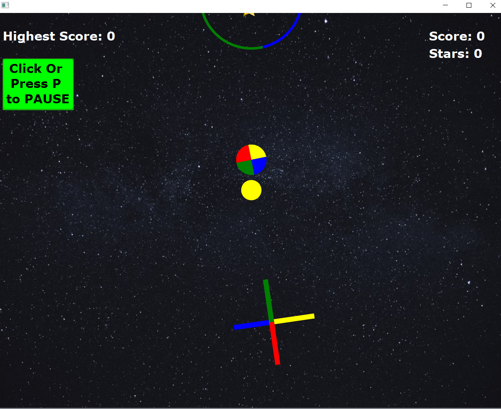

# ColorSwitch 🌈🌈

## Details

Created by: Shruti Jha and Abhinav Gudipati

This is a clone of the video game, Color Switch, originally developed by Fortafy Games.

A working demo of the game can be seen here.

Made as the course project in Advanced Programming course at IIIT-Delhi.

Uses **Java** and **JavaFx**.

## Features

1) **3 levels with increasing difficulty**.
2) **2 THEMES ( Night and Day Mode )**: Incorporated a Night and Day theme/mode which player can select in main menu.
3) **Sound Effects**:
  a) Background Sound.
  b) Obstacle collision sound.
  c) Star Collection Sound.
4) **Pause game**:
   No worries if you need to tend to something urgent, pause game option available on game screen.
5) **Save and Load game**:
   Can save any game and continue it later whenever you like!.
6) **Infinite Flow**:
   Incorporated infinite vertical flow just like the original game.
7) **LeaderBoard**
   Button in main menu to see highest score.
8) **Game Rules**:
   Included game rules where the rookie user can refer to the same. Included in both pause-menu as well as start-game menu.
9) **Restart game**:
   Option to restart available in pause menu as well as game alert box.

## Implementation

 1) **Main Menu**: Used to start new game, or load any saved game, to open game rules/instructions, to open leaderboard for highest score, and
   to select day/night mode.
 2) On starting a new game, player is taken to the game screen, with different kind of multi-colored obstacles containing stars.
 3) On loading a saved game, player is taken to the game screen with the player ball and obstacles at exact positions where game was left.
 4) **Game screen**: Contains current score, stars collected, and highest score, obstacles and player ball.
 5) Star collection : Each time the player collides with a star, it is added to the player’s star count for that particular game, and score is
 incremented by 1.
 6) Game screen has 3 levels with obstacles of increasing difficulty based on player’s score. Incorporated 74 different scenes with combinations of 13 different
   Obstacles for the sake of variety. The Easy Scenes can be maneuvered by the user, after reaching a certain score, we designed an algorithm where the player would be taken to    a scene of higher difficulty.
   - Scenes Easy - 6 obstacles : Circle , Square , Rhombus , Vertical Lines , Horizontal Lines , Plus Sig.n
   - Scenes Medium - 6 Obstacles : Concentric Circles (2) , Concentric Squares (2) , Concentric Rhombuses (2) , Vertical Lines ,
     Horizontal Lines , Plus Sign.
   - Scenes Difficult - 6 Obstacles : Concentric Circles (3) , Concentric Squares (3) , Horizontal Lines ( 3 ) , Vertical Lines , Horizontal
     Lines ( 2 parallel lines ) , Plus Sign.
 7) **Pause Menu**: Player can press ‘P’ to pause game at any time. Option available in pause menu are: resume game, restart game, to open
 game rules/instructions, and exit to main menu.
 8) **Save Game and Restart Game options** : Player can save multiple game states. Player can also restart the same game at any point of time.
 9) Game End Alert Box: On collision with an obstacle of color other than that of player, the game end alert box is thrown with following
 options: resurrect, restart game, open game rules/instructions, and exit to main menu.
 10) **Resurrection**: Player can resurrect if number of starts collected >=10, and a new game with same score but 10 stars deducted would be
 started.
 
 ## Design Patterns
 
 1) Singleton- For the database, as we need only one reference throughout the game.
 2) Iterator - To ensure that collection of Stars and Obstacles are accessed in a synchronized way.
 3) Factory- To create objects of Scenes class (ScenesEasy+ScenesMedium+ScenesDifficult).
 
 ## Threading 
 All the Animations are done using AnimationTimer , each of which is an individual thread in JVM.
 
 ## How To Play on your PC

 Executing the JAR File
 To play the game, the following steps can be followed:

 1) Download this repository ColorSwitch and unzip it.
 2) Open command prompt and cd into the unzipped folder.
 3) Then cd into the directory ColorSwitch-JAR using: ```cd ColorSwitch-JAR```.
 4) Your PC must have JavaFX SDK 15.0.1 installed. If you don't have it, download from [here](https://gluonhq.com/products/javafx/), depending on your platform.
 5) Now execute the command: ```java --module-path <PATH_TO_FX> --add-modules javafx.controls,javafx.fxml,javafx.media -jar ColorSwitch.jar```
 (Note: --module-path specifies the path to your JavaFX SDK 15.0.1 lib folder. Replace <PATH_TO_FX> with that path accordingly.)
 
 ## ScreenShots of the Game
 
 
 
 
 
 
 
 

